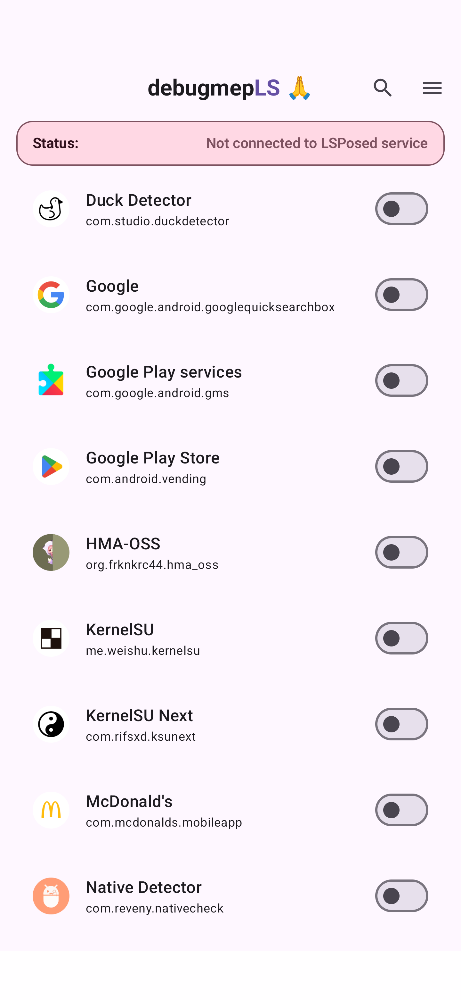
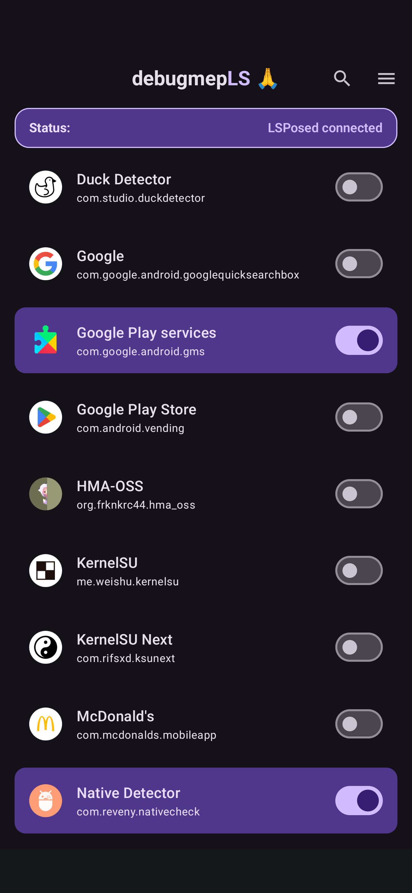

# debugmepLS

LSPosed module + companion app that forces selected apps to be debuggable on Android by hooking framework services. The app provides a scrollable list of installed apps so you can enable/disable which packages get `FLAG_DEBUGGABLE`.

<p float="left">
    
    
</p>

## Demo

<p>
    
</p>

## Features
- Per‑app enable/disable list with search and system‑app toggle
- Status header showing LSPosed service connection state
- Hooks apply in system_server only for selected packages

## Requirements
- Android 13+ (minSdk 33)
- LSPosed (libxposed API)

## Build & Install
```bash
./gradlew installDebug
```

You can also download the latest build from the project Releases page.

## Usage
1. Install the app and enable it as an LSPosed module.
2. Ensure that you select "System Framework" for the module's scope.
3. Reboot the device.
4. Open the app and wait for the status to show **LSPosed connected**.
5. Toggle the packages you want to be debuggable.
6. Relaunch the target app or process.

## How it works
Hooks in system_server modify `ApplicationInfo` (and process start flags) to enable debugging for selected packages.

## Troubleshooting
- If the status shows **Not connected to LSPosed service**, ensure the module is enabled and LSPosed is running.
- Changes apply when the target process is (re)started.

## Project Structure
- `app/src/main/java/com/vulnit/debugmepls/HookEntry.kt` – libxposed hooks
- `app/src/main/java/com/vulnit/debugmepls/ui/` – app list UI & state
- `app/src/main/assets/xposed_init` – module entry point

## Special Thanks
- @Ismael034 for the hooking points in the Android Framework.
- LSPosed team for the official libxposed example app and framework:
`https://github.com/libxposed/example/tree/master`.
